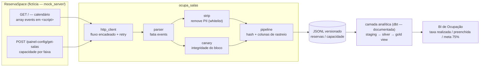

# ocupa-salas

Projeto de **estudo e portfólio**: um pipeline de dados que extrai ocupação e
capacidade de um sistema de reserva de salas — a partir de um **calendário web
sem API** — e a modela em camadas medallion para um BI de ocupação.

> ⚠️ **Tudo aqui é fictício.** A "fonte" (`ReservaSpace`) não existe: é um
> servidor FastAPI em [`mock_server/`](mock_server/) que reproduz, com dados
> gerados por semente fixa, as manias de um app server-rendered real (JSON
> embutido em `<script>`, CSRF no `<meta>`, POST que exige `X-Requested-With`,
> seleção de contexto de sessão, PII de terceiros no payload). Nenhuma
> informação de empresa, pessoa ou sistema real é usada.
>
> Este repositório é a reescrita, para portfólio, de um projeto corporativo que
> não pode ser publicado. Os **conceitos e a arquitetura** são os mesmos; os
> dados, endpoints e nomes, todos inventados.

## O que este projeto demonstra

| Tema | Onde |
|---|---|
| Ingestão por **web scraping** como exceção formal a um padrão "fonte = API REST", registrada em ADR | [`docs/adr/ADR-0001`](docs/adr/ADR-0001-ingestao-web-scraping-calendario-embutido.md) |
| **Parsing defensivo** de HTML: fatiar um array JSON balanceado de dentro de `<script>`, falhar alto quando o markup muda | [`src/ocupa_salas/parser.py`](src/ocupa_salas/parser.py) |
| **Strip de PII whitelist-only** antes de qualquer persistência + varredura de defesa em profundidade | [`src/ocupa_salas/strip.py`](src/ocupa_salas/strip.py) |
| **Versionamento por hash** (grava-quando-muda) para uma fonte mutável recoletada várias vezes ao dia | [`src/ocupa_salas/hashing.py`](src/ocupa_salas/hashing.py), [`pipeline.py`](src/ocupa_salas/pipeline.py) |
| **Canário de integridade**: contagem calculada × contagem pré-agregada da fonte, marca sem bloquear | [`src/ocupa_salas/canary.py`](src/ocupa_salas/canary.py) |
| Cliente HTTP com **retry/backoff**, tratamento nomeado de cada mania da fonte, seleção de contexto condicional | [`src/ocupa_salas/http_client.py`](src/ocupa_salas/http_client.py) |
| **Bootstrap de sessão** semi-manual (login interativo) desacoplado do runtime | [`src/ocupa_salas/bootstrap.py`](src/ocupa_salas/bootstrap.py) |
| **Fonte fictícia rodável** para testar o pipeline ponta a ponta sem rede | [`mock_server/`](mock_server/) |
| **Governança de dados (DAMA)**: arquitetura, regras de negócio, dicionário, glossário, linhagem, qualidade | [`docs/`](docs/) |
| Camada semântica / BI de ocupação (medidas, taxa como razão de somas, meta) | [`docs/bi/`](docs/bi/) |
| Orquestração: DAG de exemplo, credenciais fora do código | [`docs/airflow/`](docs/airflow/) |

## Arquitetura



O coletor produz JSONL versionado. A transformação em SQL/dbt (staging → silver →
gold) e o modelo semântico do BI estão **documentados** em [`docs/`](docs/) — o
foco do código executável é a ingestão e a garantia de qualidade na borda.

## Rodando

Requer Python ≥ 3.11.

```bash
python -m pip install -e ".[mock,dev]"
```

### 1. Testes e lint

```bash
python -m pytest -q
python -m ruff check .
```

### 2. Coleta ponta a ponta contra a fonte fictícia (sem rede, sem credencial)

```bash
python -m ocupa_salas --mock check-session
python -m ocupa_salas --mock collect --out data/
```

Isso sobe o `mock_server` em processo, roda o encadeamento
`GET /` → `/escolher-contexto` → `/set-contexto` → `GET /` →
`/painel-config/local` → `POST /painel-config/get-salas`, aplica o strip de PII,
calcula o `hash_linha` e grava `data/reservas.jsonl` + `data/capacidade.jsonl`
com colunas de rastreio (`fonte`, `id_origem`, `data_particao`, `data_extracao`,
`hash_linha`). Rodar de novo com o mesmo `data/state.json` não gera linha nova
(idempotência).

### 3. Fonte fictícia como servidor HTTP real

```bash
python -m mock_server          # http://localhost:8000  (/_docs para o OpenAPI)
```

```bash
OCUPA_SALAS_BASE_URL=http://localhost:8000 \
OCUPA_SALAS_COOKIE='RSSESSID=demo' \
OCUPA_SALAS_ID_LOCAL=1 \
python -m ocupa_salas collect --out data/
```

## Estrutura

```
src/ocupa_salas/      coletor: parser, strip, hashing, canary, http_client, bootstrap, pipeline
mock_server/          fonte fictícia (FastAPI) + gerador sintético determinístico
tests/                pytest, sem rede; fixtures sintéticas + teste ponta a ponta contra o mock
docs/                 ADR, mapeamento da fonte, governança DAMA, BI, Airflow
```

## Cabeçalho de proveniência

Todo módulo do coletor abre com um bloco que diz de onde ele vem e para onde
levar dúvida — prática trazida do projeto original. `tests/test_provenance.py`
falha se algum módulo perder o cabeçalho.

## Licença

[MIT](LICENSE).
