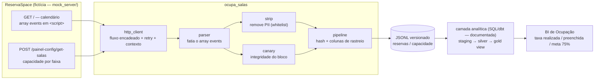

# ocupa-salas

Um pipeline de dados que arranca a **taxa de ocupação de salas** de um sistema de
reserva que nunca foi feito para entregar esse número — e o faz sem vazar um byte
de dado pessoal pelo caminho.

> ⚠️ **Tudo aqui é fictício.** A "fonte" (`ReservaSpace`) não existe: é um servidor
> FastAPI em [`mock_server/`](mock_server/) que reproduz, com dados gerados por
> semente fixa, as manias de um app server-rendered real — JSON embutido em
> `<script>`, CSRF no `<meta>`, POST que exige `X-Requested-With`, seleção de
> contexto de sessão, PII de terceiros no payload. Nenhuma informação de empresa,
> pessoa ou sistema real é usada. Projeto de **estudo e portfólio**.

---

## A história

O pedido chega simples: *"quero acompanhar quão cheias estão as salas do coworking,
atualizado ao longo do dia."* O sistema de reserva já existe e funciona bem. O
problema é tudo que está entre ele e esse número.

**Não há API.** A tela de calendário é renderizada no servidor; os dados de reserva
vêm **embutidos como um array JSON dentro de um `<script>`** na resposta do `GET /`.
A capacidade das salas mora em outro lugar — um `POST` que só responde se você
mandar o header `X-Requested-With` e um token CSRF que muda a cada sessão e precisa
ser raspado do `<meta>` da página. Sem o header, o servidor devolve `200 OK` com
**corpo vazio**, sem erro nenhum. É uma coleção de armadilhas silenciosas.

**A capacidade não é um número fixo.** Cada sala tem uma lotação base, mas a escala
do dia sobrepõe isso com exceções datadas cadastradas à mão — às vezes no meio do
expediente. "Capacidade do dia" só existe como *regra resolvida por data*, não como
atributo.

**O payload é uma mina de dado sensível.** Cada reserva vem acompanhada do cadastro
**completo** do membro — CPF, RG, data de nascimento, contato de emergência,
necessidades de acessibilidade — e da empresa contratante, replicado a cada
ocorrência. Boa parte dos campos carrega sufixo `Crm`: o cadastro nem nasce aqui, é
replicado de um CRM a montante. Nada disso pode tocar o disco.

**E o BI precisa estar fresco.** Latência de um dia não serve; o número tem que
refletir o que mudou nas últimas horas.

Cada uma dessas fricções virou uma decisão registrada em
[`docs/adr/ADR-0001`](docs/adr/ADR-0001-ingestao-web-scraping-calendario-embutido.md):

| Fricção | Decisão |
|---|---|
| Fonte sem API, dado preso no HTML | Ingestão por **web scraping** tratada como *exceção formal* ao padrão "fonte = API REST" — só a extração é especial; o resto segue genérico. |
| Login SSO+MFA, sem conta de serviço | **Bootstrap de sessão** semi-manual: um humano autentica uma vez, o cookie vai para a Connection, o runtime é HTTP puro. |
| Registros mutáveis recoletados ~8×/dia | **Versionamento por hash**: grava linha nova só quando o conteúdo muda; re-rodar o mesmo horário é idempotente. |
| PII de terceiros no payload | **Strip whitelist-only** em memória, antes de qualquer escrita — o objeto do membro nunca é serializado. Uma varredura de defesa em profundidade barra a carga se algo escapar. |
| Truncamento silencioso do array | **Canário de integridade**: a contagem calculada é conferida contra a contagem pré-agregada da própria fonte; divergência marca o dia sem bloquear. |
| Capacidade que muda no meio do dia | Marts intradiários como **`view`** sobre a staging — refletem a última coleta sem esperar o build noturno. |
| Não há histórico navegável na fonte | O coletor é **forward-only**; a série temporal se acumula a partir da entrada em produção. |

O resultado é um coletor pequeno, com cada mania da fonte tratada por um erro
nomeado — nunca um silêncio — e dados de ocupação prontos para modelar, sem dado
pessoal em lugar nenhum.

## A solução em uma imagem



Neste repositório rodam **o coletor e as garantias de qualidade na borda**
(`src/ocupa_salas/`, `mock_server/`). A transformação em SQL/dbt (staging → silver →
gold) e o modelo semântico do BI estão **documentados** em [`docs/`](docs/) — o
código executável se concentra na ingestão, onde estão as decisões difíceis.

## O que dá pra ver no código

| Tema | Onde |
|---|---|
| Ingestão por web scraping como exceção formal a um padrão, registrada em ADR | [`docs/adr/ADR-0001`](docs/adr/ADR-0001-ingestao-web-scraping-calendario-embutido.md) |
| **Parsing defensivo**: fatiar um array JSON balanceado de dentro de `<script>`, falhar alto quando o markup muda | [`src/ocupa_salas/parser.py`](src/ocupa_salas/parser.py) |
| **Strip de PII whitelist-only** + varredura de defesa em profundidade | [`src/ocupa_salas/strip.py`](src/ocupa_salas/strip.py) |
| **Versionamento por hash** (grava-quando-muda) para uma fonte mutável | [`hashing.py`](src/ocupa_salas/hashing.py), [`pipeline.py`](src/ocupa_salas/pipeline.py) |
| **Canário de integridade**: contagem calculada × contagem pré-agregada da fonte | [`src/ocupa_salas/canary.py`](src/ocupa_salas/canary.py) |
| Cliente HTTP com **retry/backoff**, cada mania da fonte num erro nomeado, seleção de contexto condicional | [`src/ocupa_salas/http_client.py`](src/ocupa_salas/http_client.py) |
| **Bootstrap de sessão** semi-manual, desacoplado do runtime | [`src/ocupa_salas/bootstrap.py`](src/ocupa_salas/bootstrap.py) |
| **Fonte fictícia rodável** para testar o pipeline ponta a ponta sem rede | [`mock_server/`](mock_server/) |
| **Governança de dados (DAMA)**: arquitetura, regras de negócio, dicionário, glossário, linhagem, qualidade | [`docs/`](docs/) |
| Camada semântica / BI (medidas DAX, taxa como razão de somas, meta) | [`docs/bi/`](docs/bi/) |
| Orquestração: DAG de exemplo, credenciais fora do código | [`docs/airflow/`](docs/airflow/) |

## Rodando

Requer Python ≥ 3.11.

```bash
python -m pip install -e ".[dev]"
```

### Testes e lint

```bash
python -m pytest -q
python -m ruff check .
```

### Coleta ponta a ponta contra a fonte fictícia (sem rede, sem credencial)

```bash
python -m ocupa_salas --mock check-session
python -m ocupa_salas --mock collect --out data/
```

Isso sobe o `mock_server` em processo e roda o encadeamento completo
(`GET /` → `/escolher-contexto` → `/set-contexto` → `GET /` → `/painel-config/local`
→ `POST /painel-config/get-salas`), aplica o strip de PII, calcula o `hash_linha` e
grava `data/reservas.jsonl` + `data/capacidade.jsonl` com colunas de rastreio
(`fonte`, `id_origem`, `data_particao`, `data_extracao`, `hash_linha`). Rodar de novo
com o mesmo `data/state.json` não gera linha nova — é idempotente.

### A fonte fictícia como servidor HTTP real

```bash
python -m mock_server          # http://localhost:8000  (/_docs para o OpenAPI)
```

```bash
OCUPA_SALAS_BASE_URL=http://localhost:8000 \
OCUPA_SALAS_COOKIE='RSSESSID=demo' \
OCUPA_SALAS_ID_LOCAL=1 \
python -m ocupa_salas collect --out data/
```

## Estrutura

```
src/ocupa_salas/   coletor: parser, strip, hashing, canary, http_client, bootstrap, pipeline
mock_server/       fonte fictícia (FastAPI) + gerador sintético determinístico
tests/             pytest sem rede; fixtures sintéticas + teste ponta a ponta contra o mock
docs/              ADR, mapeamento da fonte, governança DAMA, BI, Airflow
```

## Cabeçalho de proveniência

Todo módulo do coletor abre com um bloco que diz de onde ele vem e para onde levar
dúvida. `tests/test_provenance.py` falha se algum módulo perder o cabeçalho.

## Licença

[MIT](LICENSE).
