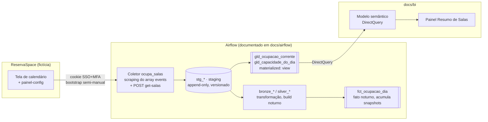
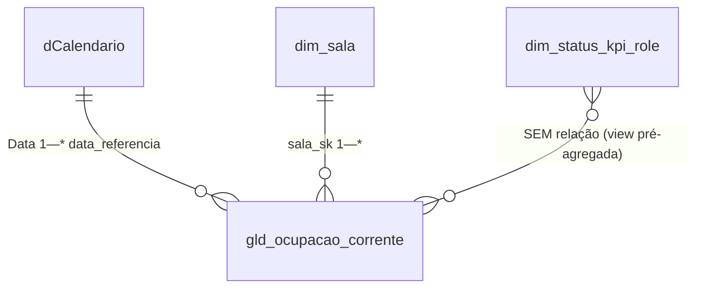

# Arquitetura de Dados — BI de Ocupação de Salas

> Complementa [`../CONTEXT.md`](../CONTEXT.md) (modelo de domínio) e
> [`adr/ADR-0001`](adr/ADR-0001-ingestao-web-scraping-calendario-embutido.md)
> (decisão de ingestão). Aqui: componentes, fluxo e responsabilidades.

## 1. Visão geral

Extrai reservas e capacidade da plataforma fictícia **`ReservaSpace`**, modela em
camadas medallion (raw → gold) e entrega um painel de ocupação de salas. Fase
atual: **local único**, janela **forward-only** (mês vigente → futuro).

Neste repositório rodam **o coletor e as garantias de qualidade na borda**
(`src/ocupa_salas/`, `mock_server/`). A camada de transformação (staging → silver →
gold) e o modelo semântico estão **documentados** aqui e em `docs/bi/`.

## 2. Componentes

| Componente | Papel |
|---|---|
| **Coletor** (`ocupa_salas`) | Extrai `events` (HTML) e capacidade (`POST get-salas`). Aplica strip de PII, canário de integridade e versionamento por hash. Orquestração Airflow; credenciais em Connection / `OCUPA_SALAS_*`. |
| **Fonte fictícia** (`mock_server`) | FastAPI + gerador sintético determinístico. Reproduz as manias da fonte real para o pipeline rodar ponta a ponta sem rede. |
| **Staging** (`stg_*`) | Linhas raw append-only, versionadas por `data_particao` / `data_extracao`. Compactação por hash. |
| **Bronze / Silver** | Conformação, `dim_*`, timeline de status, capacidade resolvida por dia. Build noturno. |
| **Gold — mart intradiário** | `gld_ocupacao_corrente`, `gld_capacidade_do_dia` (`materialized: view`). Leem `stg_*` direto, resolvem versão corrente em tempo de consulta. **Fonte do BI.** |
| **Gold — fato noturno** | `fct_ocupacao_dia` (`table`). Acumula o histórico de snapshots. Uso futuro (série temporal). |
| **Modelo semântico / Relatório** | Fato (view, DirectQuery) + calendário + `dim_sala` + `dim_status_kpi_role` + medidas. Ver `docs/bi/`. |

## 3. Grão

| Objeto | Grão |
|---|---|
| `stg_reservas` | 1 linha por versão de reserva (`idReserva` × `data_particao`) |
| `gld_ocupacao_corrente` | **(`data_referencia`, `faixa_horario_sk`, `sala_sk`)** — 1 linha por sala/faixa por dia |
| `fct_ocupacao_dia` | idem + dimensão de snapshot |
| Painel | agrega o fato por período (slicer obrigatório) / sala / turno |

## 4. Modelo semântico

- **`gld_ocupacao_corrente`** — fato, **DirectQuery**. Sempre fresco; grão pequeno.
- **`dCalendario`** — tabela de datas (`CALENDAR`). Eixos: Data, Início Semana, Ano-Mês.
- **`dim_sala`** — derivada de `stg_capacidade`. Traz `nome_sala`, `turno`.
- **`dim_status_kpi_role`** — cópia do seed. Oculta, sem relação — a view já entrega
  os baldes agregados.

## 5. Ambientes

| Ambiente | Fonte do BI |
|---|---|
| **dev** | `gld_ocupacao_corrente` no Postgres `staging` local. Uma coleta, um local. |
| **prd** (alvo) | Mesma view em `prd`. DirectQuery serve (view, sempre fresca). |

## 6. Dependências e bloqueios

| Item | Efeito |
|---|---|
| **Login na fonte exige MFA** | O bootstrap de sessão é semi-manual e produz um cookie reutilizável. Sem renovação sem segundo fator, a DAG não roda sozinha em produção → série histórica não acumula. **Bloqueio principal.** |
| Build noturno | `dim_*` e `fct_*` dependem dele. O BI contorna usando só as `view`s `gld_*`. |
| Fuso `data_referencia` | Reconfirmar em prd. |
| Status "Concluído com Pendência" | Ainda não observado; quando aparecer, precisa entrar em `dim_status_kpi_role`. |
